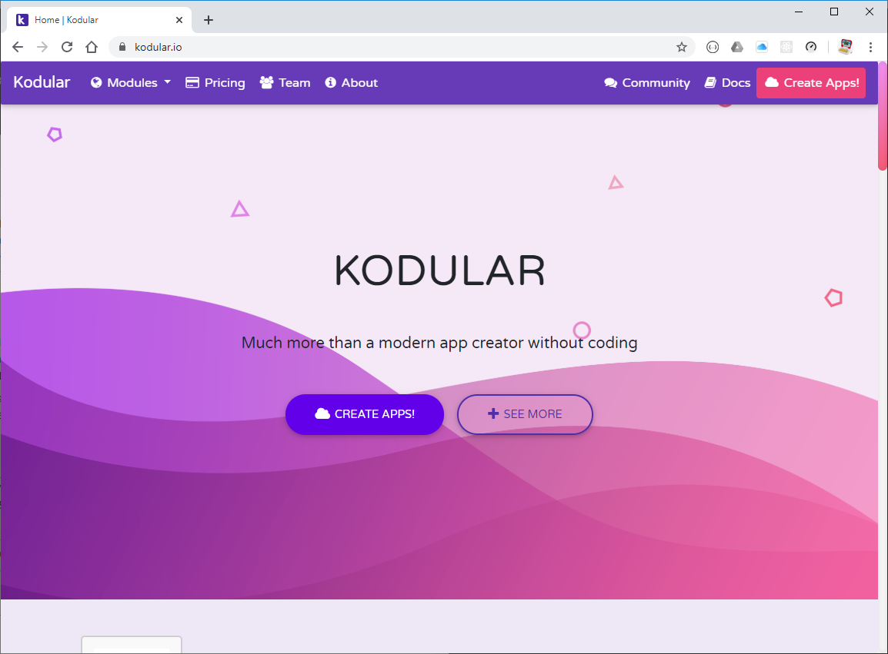
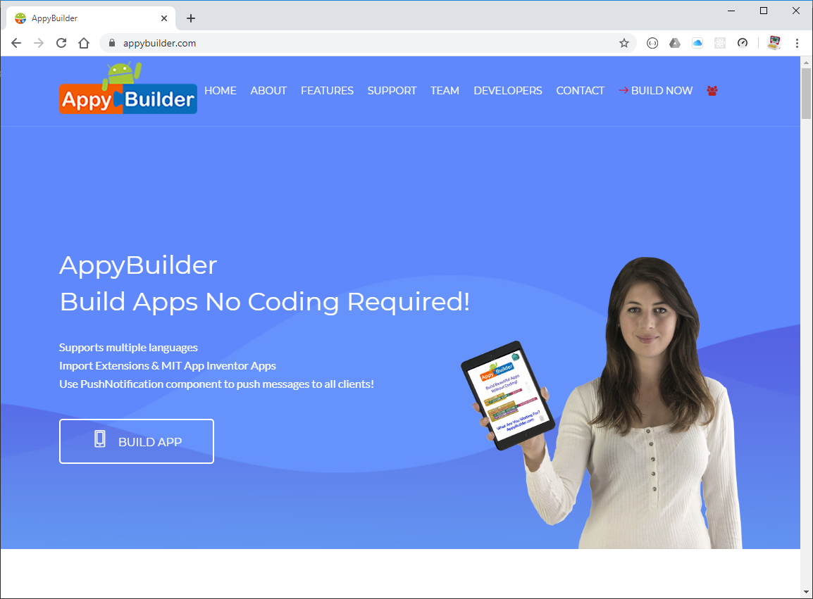
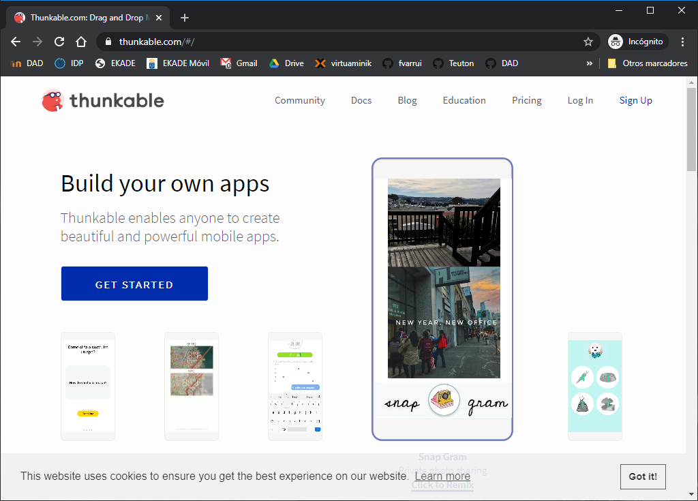
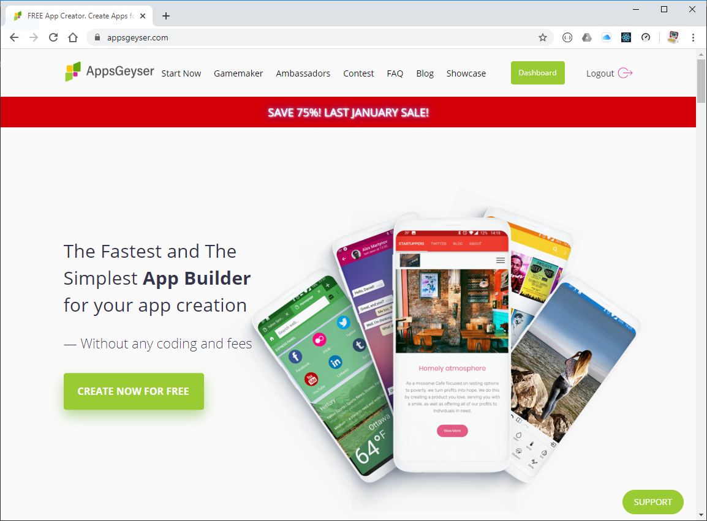

Existen otras aplicaciones web que nos permiten crear aplicaciones para dispositivos móviles con la misma facilidad que App Inventor. Algunas de estas alternativas se han creado a partir de App Inventor, por lo que su funcionamiento es muy similar. En cambio, otras de estas alternativas, pese a que son tan sencillas de usar como App Inventor, difieren en cuanto a funcionamiento.

## Kodular

Esta plataforma para crear aplicaciones para dispositivos Android está basada en App Inventor, con un funcionamiento similar, pero con una interfaz de usuario mejorada, más usable y vistosa. También ofrece más componentes que podemos emplear para crear nuestras aplicaciones, así como funcionalidades que App Inventor no ofrece y que facilitan su uso. A diferencia de App Inventor, no es un requisito disponer de una cuenta de Google para poder utilizarlo.

Si tenemos proyectos creados en App Inventor, es posible migrarlos a esta plataforma, pues permite importar ficheros `AIA`.

Podemos acceder desde el siguiente [enlace](https://www.kodular.io/).

## AppyBuilder

Plataforma para crear aplicaciones para dispositivos Android también basada en App Inventor. Su interfaz de usuario es muy similar a App Inventor, pero incluyendo muchos más componentes que podemos utilizar para construir nuestras aplicaciones.

Podemos acceder desde el siguiente [enlace](http://www.appybuilder.com/).

## Thunkable

Esta alternativa a App Inventor permite **crear aplicaciones para disposivos móviles Android e iOS**. Ofrece una interfaz muy similar a App Inventor: dispone de un diseñador de interfaz y un editor de bloques para programar el comportamiento de la aplicación. No es de código abierto, pero es gratuita si nuestros proyectos son públicos. Para disponer de proyectos privados es necesario la suscripción de pago, así como para poder publicar las apps en el App Store (iOS) o en Google Play (Android).

Podemos acceder desde el siguiente [enlace](https://thunkable.com/#/).

## AppsGeyser

Esta plataforma web nos permite crear aplicaciones nuevas para Android a partir de plantillas, lo que facilita mucho el trabajo y permite tener una aplicación operativa en cuestión de minutos. Prácticamente consiste en elegir una plantilla y configurar sus parámetros para adaptarlos a nuestras necesidades. No se requieren en absoluto conocimientos de programación, pues ni siquiera hay un editor de bloques para diseñar el comportamiento de nuestra aplicación, algo que en parte le resta operatividad. También incluye opciones que facilitan la distribución de nuestras aplicaciones a través de distintos portales como Google Play, y poder obtener beneficio por ello.

Podemos acceder desde el siguiente [enlace](https://appsgeyser.com/).

