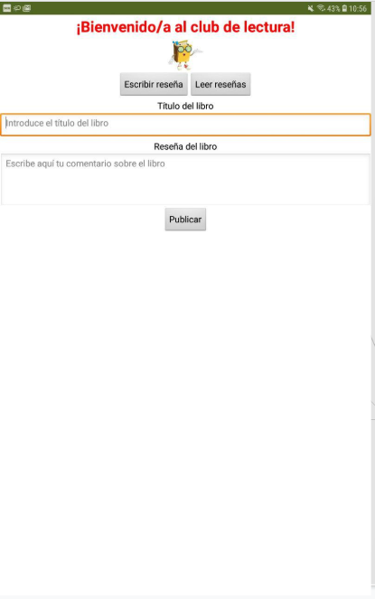

La app que vamos a desarrollar en este proyecto permite a los estudiantes publicar reseñas sobre libros así como consultar las reseñas publicadas por otros estudiantes.

La información se almacena en la nube (cloud), lo que permite intercambiar información entre los usuarios de la app.

## Medios

No necesarios para este proyecto.

## Interfaz

La app contará con dos pantallas: 

- **Screen1**: Pantalla principal donde se podrán escribir reseñas y listar los libros para los que se han escrito reseñas.
- **Screen2**: Donde se listarán las reseñas de un libro seleccionado en la pantalla principal (Screen1).

### Screen1

La interfaz de la pantalla principal será la siguiente:

Componentes no visibles utilizados en este proyecto:

- **TinyDB**: Se trata de una base de datos interna que usan las apps para almacenar información y que ésta persista, es decir, que cuando cerremos la aplicación y la volvamos a abrir, esta información siga ahí. 

  Lo vamos a utilizar para guardar la información del libro seleccionado para consultar las reseñas desde Screen1 y recuperar ese valor en Screen2 (intercambio de datos entre pantallas).

- **CloudDB**: Similar a TinyDB, sólo que la información no se almacena en nuestro dispositivo, sino en la nube (servidor de App Inventor).

  Lo usaremos para almacenar las reseñas de los libros; de este modo, al estar en la nube, pueden ser consultadas por todos los usuarios de la app.

  :warning: Debemos tener en cuenta la privacidad en este caso, pues la información se almacena en servidores del MIT (en EE.UU.).

> Las bases de datos que gestionan **TinyDB** y **CloudDB** son de tipo *diccionario*, es decir, que la información la almacenan en forma de **nombre** y **valor**. 
>
> - Para *almacenar* un dato le indico el nombre que quiero darle, para recuperarlo con posterioridad, y el valor que quiero almacenar con dicho nombre. 
> - Para *recuperar* un dato le damos el nombre y devolverá la información previamente almacenada con dicho nombre.

### Screen2 

La interfaz de la pantalla secundaria donde se listan las reseñas dle libro seleccionado es la siguiente:

## Comportamiento

### Screen1

#### Estado inicial de la pantalla

Inicialmente queremos que los paneles para escribir reseñas (`WriteReviewVerticalArrangement`) y para listar los libros comentados (`ReadReviewsVerticalArrangement`) no se muestren, sino que lo hagan al pulsar el botón correspondiente.

Para ello tenemos que indicar que sean invisibles (`poner componente.Visible como falso`) al iniciar la pantalla principal (evento `cuando Screen1.Inicializar`).

#### Empezar a escribir una reseña

Al pulsar el botón `Escribir reseña` se deberá mostrar el panel con los campos para introducir los datos de la reseña (y si está visible el panel de leer reseñas, lo ocultamos).

#### Publicar una reseña

Cuando se haya cumplimentado el título del libro (`TitleTextBox`) y el comentario (`ReviewTextBox`) en el formulario para introducir la nueva reseña (`WriteReviewVerticalArrangement`) y se pulse el botón de **Publicar** (`SubmitButton`), se deberá almacenar esta información en la nube (`llamar CloudDB1.AppendValueToList`), vaciar los campos y ocultar el panel para introducir reseñas.

#### Listar los libros comentados

Para listar los libros comentados se pulsará el botón **Leer reseñas** (`ReadReviewsButton`). Esto hará que se soliciten a la base de datos en la nube todos los libros (tags) que se han añadido, se muestre el panel con el listado de los libros (`ReadReviewsVerticalArrangement`) y se oculte el panel de escribir reseñas (`WriteReviewVerticalArrangement`) si estuviera visible.

El bloque `llamar CloudDB1.GetTagList` no recupera los datos directamente, sino que envía una petición al servidor en la nube. Cuando el componente tenga los datos, lanzará un evento, que podremos procesar con el siguiente bloque.

El bloque anterior ofrece una variable que podremos usar dentro de los bloques le añadamos. En este caso, el valor `value` contiene una lista con los **tags** (etiquetas o nombres que hemos dado a la información que hemos almacenado en la base de datos), y se los pasamos al componente de lista (`BookList`) que los mostrará.

#### Seleccionar un libro de la lista

Una vez se ha cargado la lista con los libros (`Bookslist`) de la base de datos (`CloudDB1`) , el usuario ya podrá seleccionar el que quiere consultar.

Al seleccionar un libro se dispara el evento `DespuésDeSelección`, y lo que hará la app es almacenar el título del libro seleccionado (`BookList.Selección`) en la base de datos local (`TinyDB1'`) y abrirá la pantalla `Screen2`.

Eso es todo el comportamiento de la pantalla principal.

### Screen2

#### Estado inicial de la pantalla

## Prueba

