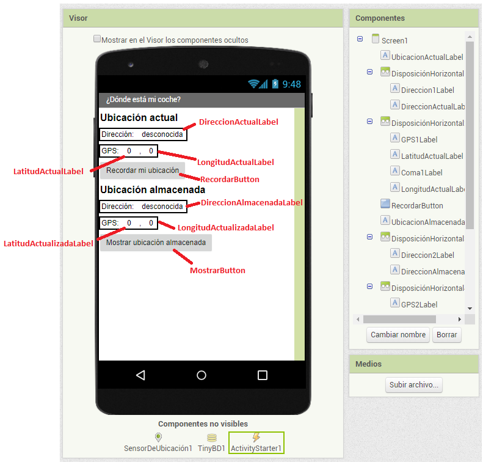
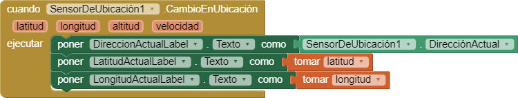
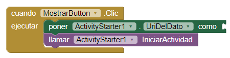
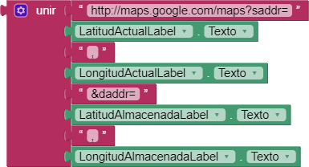
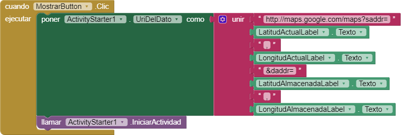
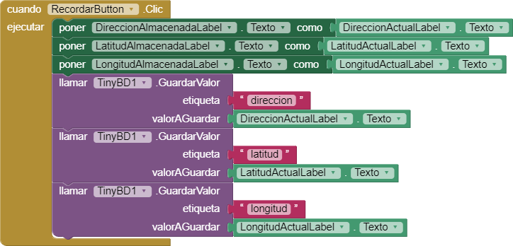
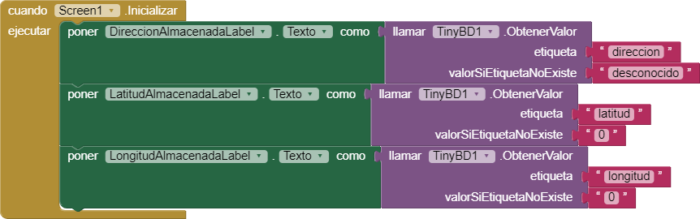
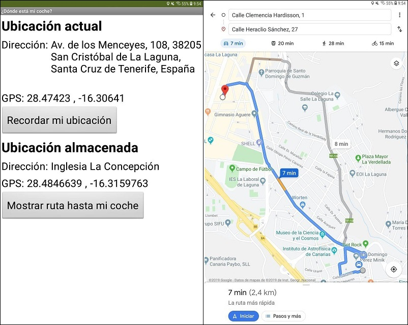

Acabas de terminar de hacer unas gestiones y al volver a por tu coche te das cuenta que no recuerdas dónde lo aparcaste.

Por suerte, recuerdas que tienes la app **¿Dónde está mi coche?** en el móvil. Esta app te permite guardar tu ubicacion GPS y la dirección con solo pulsar un botón nada más aparcar. Más tarde, abres la aplicación y ésta te muestra un mapa con la ubicación de tu coche y la dirección donde lo dejaste aparcado.

## Medios

No necesarios para este proyecto.

## Interfaz

La interfaz para esta aplicación es la que se muestra en la siguiente ilustración:



> Los nombres de los componentes que se usarán desde el **Editor de bloques** se han resaltado en rojo.

Componentes no visibles utilizados en este proyecto:

- **SensorDeUbicación**: Este componente permite obtener información sobre la localización del dispositivo (dirección, coordenadas GPS, ...).

- **TinyDB**: Se trata de una base de datos interna que usan las apps para almacenar información y que ésta persista, es decir, que cuando cerremos la aplicación y la volvamos a abrir, esta información siga ahí.

- **ActivityStarter**: En Android las pantallas se llaman actividades (Activities). Es posible abrir pantallas de otras aplicaciones instaladas en el móvil. Este componente es el que permite hacer esto.

  En este proyecto abriremos la pantalla de mapas de la app Google Maps, para lo que debemos configurar las siguiente propiedades en `ActivityStarter1`:

  - *Acción*: `android.intent.action.VIEW`
  - *Clase*: `com.google.android.maps.MapsActivity`
  - *Paquete*: `com.google.android.apps.maps`

  Para abrir actividades de otras apps necesitamos conocer los datos anteriores.

## Comportamiento

### Obtener la ubicación actual

Queremos que las etiquetas con la dirección y las coordenadas GPS de la ubicación actual muestren la información capturada por el sensor de ubicación del dispositivo móvil.

Para esto creamos un evento que se ejecutará cuando cambie la ubicación del dispositivo. Dentro del evento, una vez tenemos la ubicación actual, actualizamos las etiquetas para mostrar esa información al usuario. 

El conjunto de bloques quedaría de la siguiente forma:



Este evento se "dispara" cada vez que cambie la ubicación GPS del dispositivo.

### Abrir la ruta en Google Maps

Al pulsar el botón **Mostrar ubicación almacenada** queremos que se abra *Google Maps* mostrando la ruta desde la ubicación actual hasta la ubicación almacenada, haciendo uso de las coordenadas. Para ello debemos iniciar la actividad `ActivityStarter1`:



Para pasar información a la actividad usamos la propiedad `UriDelDato` (en el diagrama anterior está vacío), que en el caso de Google Maps es una URL (enlace) como la siguiente:

```
http://maps.google.com/maps?saddr=LAO,LOO&daddr=LAD,LOD
```

donde:

- **LAO**: LAtitud de Origen
- **LOO**: LOngitud de Origen
- **LAD**: LAtitud de Destino
- **LAO**: LAtitud de Destino

Por ejemplo, la URL para obtener la ruta para ir desde La Laguna (latitud: 28.4698336, longitud: -16.3258648) hasta  el Teide (latitud: 28.2961806, longitud: -16.5678874) sería la siguiente:

http://maps.google.com/maps?saddr=28.4698336,-16.3258648&daddr=28.2961806,-16.5678874

Para crear esta URL a partir de los coordenadas almacenadas en las etiquetas necesitamos un bloque como el siguiente:



Quedando finalmente el conjunto de bloques de la siguiente manera:



### Almacenar las coordenadas actuales

Ahora queremos que la aplicación guarde las coordenadas actuales al pulsar el botón **Recordar mi ubicación**.

Para almacenar información en el dispositivo, de forma que esta siga estando disponible cuando reiniciemos nuestra aplicación, usamos el componente `TinyBD1`.

El conjunto de bloques quedaría de la siguiente forma:



El bloque `llamar TinyBD1.GuardarValor` almacena el dato que le indiquemos en `valorAGuardar` con el nombre `etiqueta`. El nombre es importante para poder recuperar el dato con posterioridad. Hay 3 bloques similares porque estamos guardando 3 datos: dirección, latitud y longitud.

### Cargar los datos almacenados al iniciar la aplicación

Al abrir de nuevo la aplicación queremos que se muestre la ubicación almacenada.

Necesitamos crear un evento que se ejecutará al iniciar la pantalla de la aplicación. Por esto añadimos el bloque `cuando Screen1.Inicializar`.

Dentro de este bloque, recuperamos los valores almacenados con anterioridad mediante `TinyBD1` y los ponemos en las etiquetas que muestran la ubicación almacenada.



El bloque `llamar TinyBD1.ObtenerValor` recupera el valor almacenado con nombre `etiqueta`. En caso de que este valor no exista, este bloque devuelve lo que hayamos conectado a `valorSiEtiquetaNoExiste`.

## Prueba

