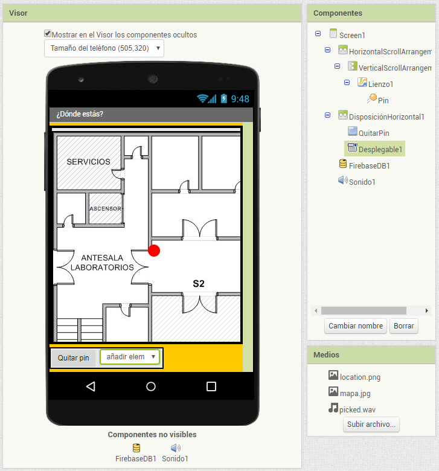
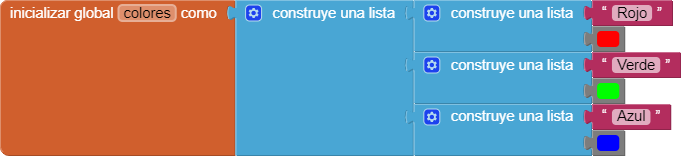
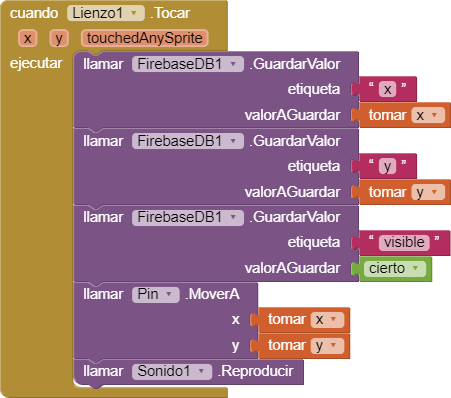
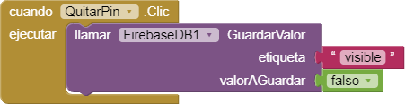
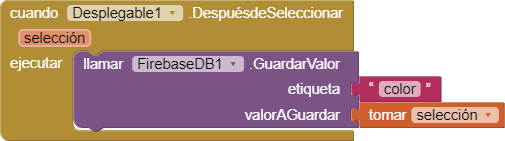
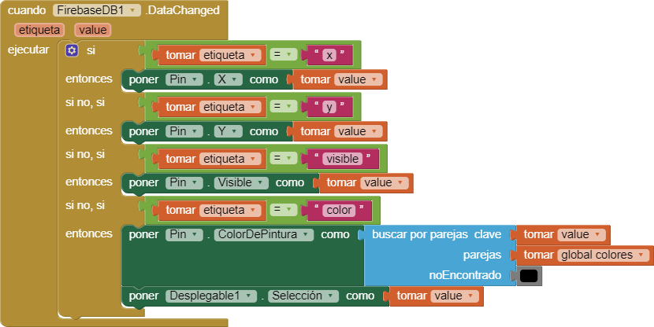
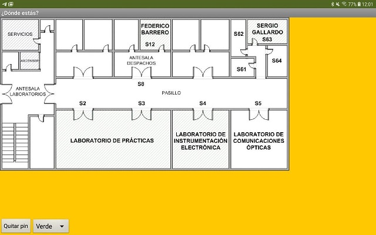

La app que vamos a desarrollar en este proyecto permite localizar y compartir en tiempo real una ubicación en un plano (p.ej.: el plano del instituto, de nuestra casa, de un edificio, ...).

Para compartir información entre las apps se ha utilizado el componente **FirebaseDB**, que permite notificar a los dispositivos conectados cualquier cambio realizado a la información almacenada.

## Medios

* Icono de la aplicación: [location.png](location.png).
* Plano: [mapa.jpg](mapa.jpg).
* Sonido: [picked.wav](picked.wav).

## Interfaz

La interfaz de la pantalla principal será la siguiente:

## Comportamiento

### Variable global para almacenar la lista de colores disponibles

### Cuando se toca el lienzo (plano)

### Cuando se pulsa el botón de quitar el pin

### Cuando seleccionamos un color en el desplegable

### Cuando cambiamos los datos almacenados en FirebaseDB

## Prueba

