Aplicación que muestra la imagen de un burro que rebuzna al pulsar el botón.

### Crear el proyecto

Creamos un proyecto [nuevo](../../tutoriales/crear-un-proyecto-nuevo) de nombre `HolaBurrito`.

### Interfaz

Abrimos el [Diseñador](../../tutoriales/disenador).

#### Medios

1. Descargamos la imagen del [burro](https://github.com/fvarrui/AppInventor/raw/master/_doc/practicas/hola-burrito/burro.png) y el sonido del [rebuzno](https://github.com/fvarrui/AppInventor/raw/master/_doc/practicas/hola-burrito/rebuzno.mp3) a nuestro PC.

2. Subimos la imagen del burro al proyecto:

   - En el panel **Medios** pulsamos el botón **Subir archivo...**, 

     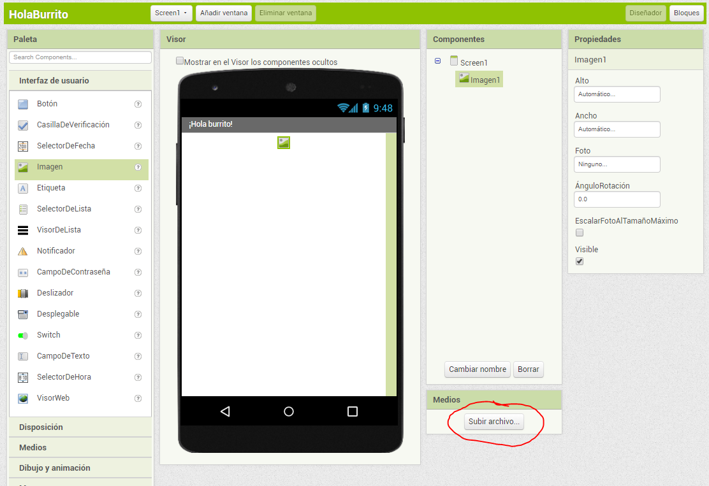

   - Luego el botón **Seleccionar archivo**, localizamos el archivo de la imagen del burro y pulsamos el botón **Abrir**, y finalmente el botón **Aceptar** para subirla.

     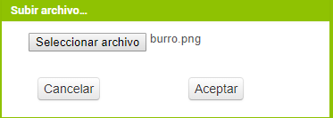

3. Subimos el audio con el rebuzno al proyecto:

   - Repetimos el paso anterior para subir el audio con el rebuzno.

Cuando hayamos subido los dos archivos, el panel **Medios** quedaría así:

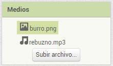

#### Configurar la pantalla principal

1. Seleccionamos `Screen1`.

   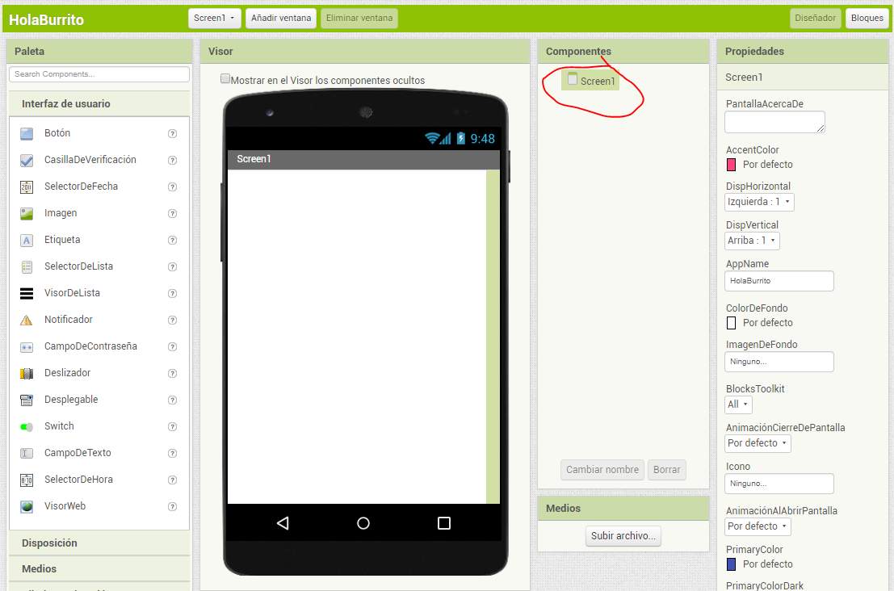

2. Establecemos la propiedad `DispHorizontal` de `Screen1` a `Centro`, para que los componentes se centren en la horizontal de la pantalla.

   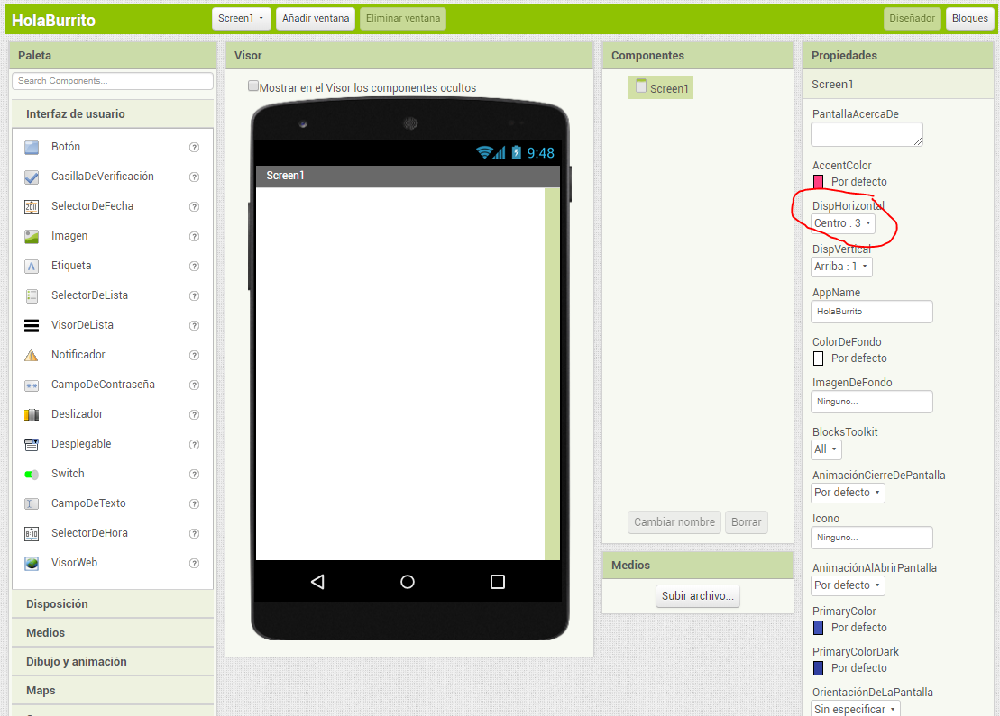

3. Cambiamos el título de la pantalla a **¡Hola burrito!** mediante la propiedad `Título`.

   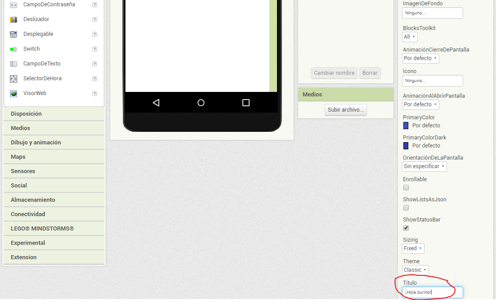

#### Añadir la imagen del burro

1. Arrastramos el componente `Imagen` desde la **Paleta** a la pantalla `Screen1` en el **Visor**.

   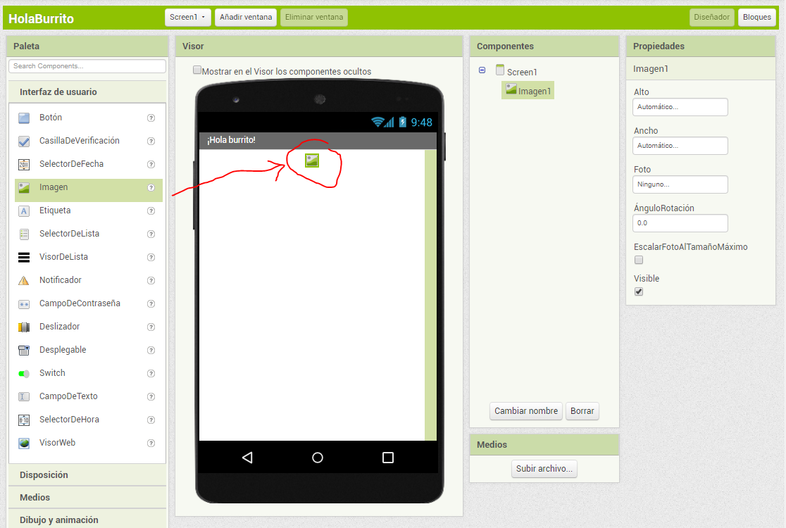

2. Cambiamos la propiedad `Foto` de `Imagen1` a `burro.png`.

   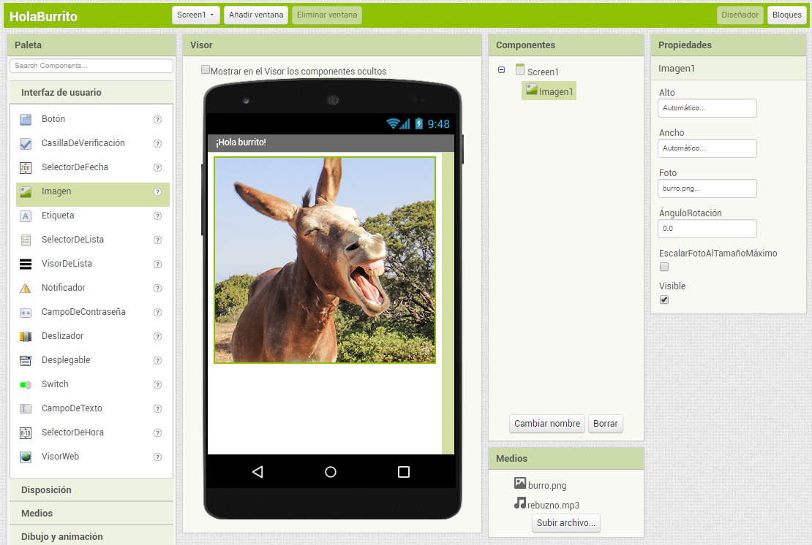

#### Añadir un botón

1. Arrastramos el componente `Botón` desde la **Paleta** a la pantalla `Screen1` en el **Visor**, justo debajo de  `Imagen1`.

   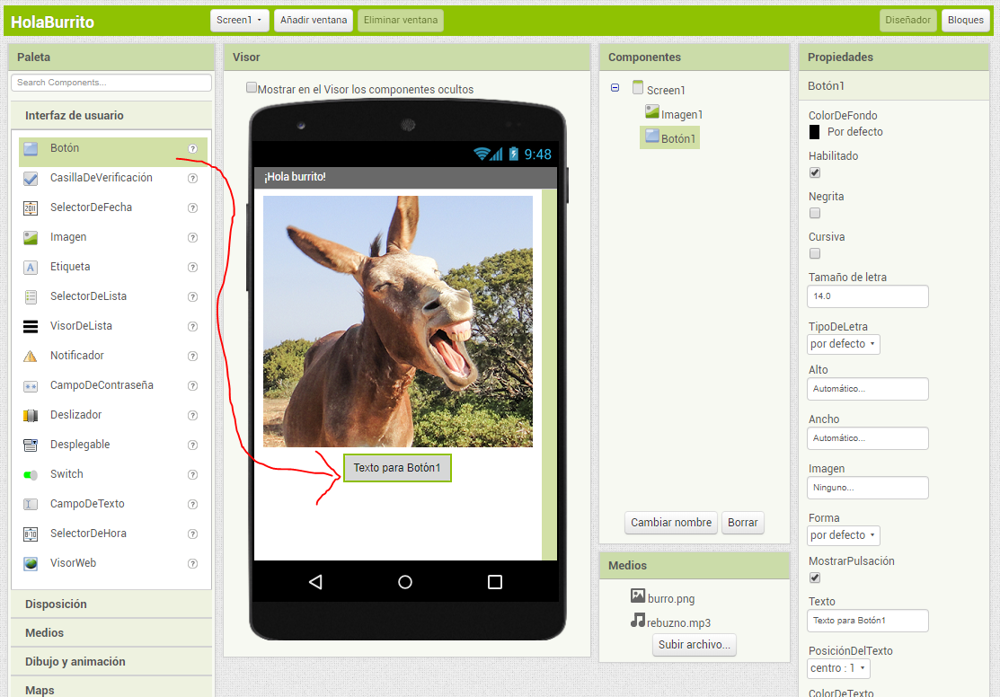

2. Cambiamos la propiedad `Texto` del `Botón1` a `Púlsame`.

   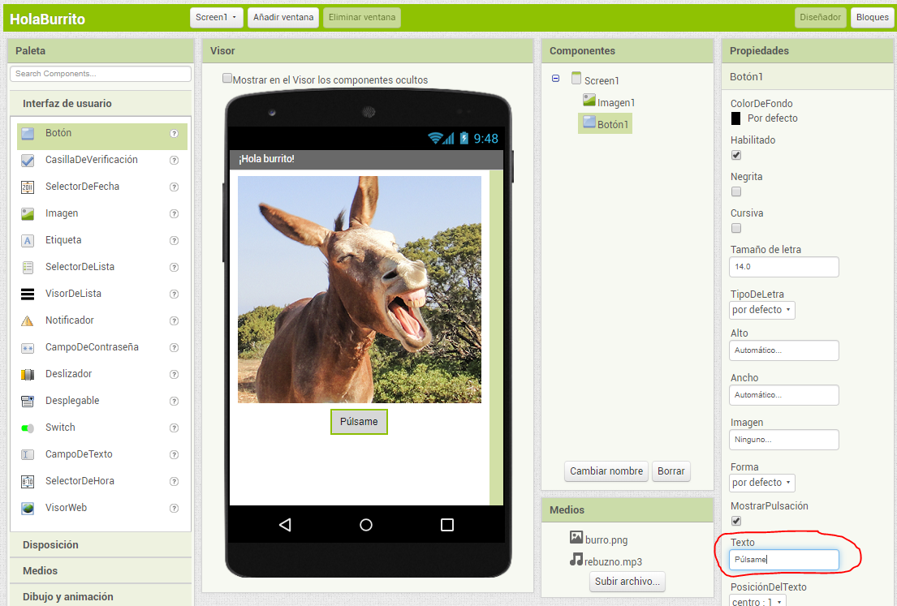

#### Añadir el sonido

1. Arrastramos el componente `Sonido` desde la **Paleta** a la pantalla `Screen1` en el **Visor**. Al tratarse de un componente que no se visualiza, se mostrará fuera de la pantalla en la parte inferior.

   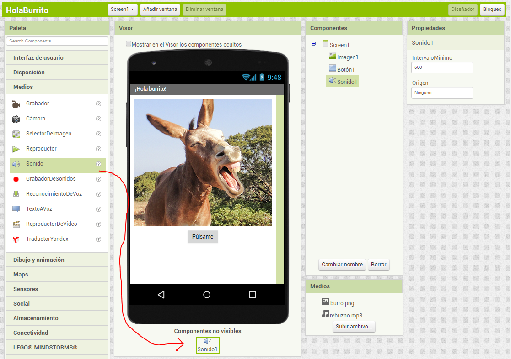

2. Cambiamos la propiedad `Origen` del `Sonido1` a `rebuzno.mp3`.

   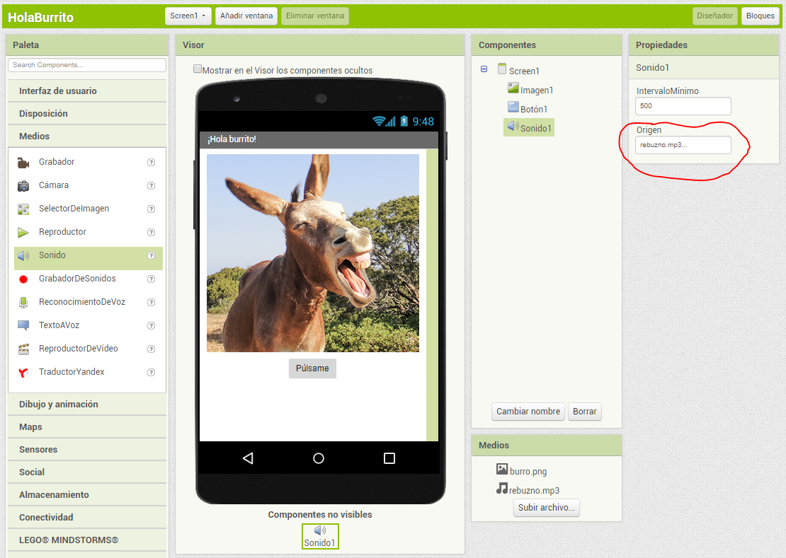

### Comportamiento

Para que nuestra aplicación reproduzca el audio **rebuzno.mp3** cuando se haga clic en `Botón1` debemos ir al **[Editor de bloques](../../editor-de-bloques)** y seguir los siguiente pasos:

1. En el panel **Bloques** seleccionamos `Botón1`, y se mostrarán todos los bloques relacionados con este componente.

   

2. Para que se ejecute una acción al hacer clic sobre el botón, arrastramos al **Visor** el bloque `cuando Boton1.Clic`.

   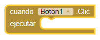

3. Seleccionamos `Sonido1` y arrastramos el bloque `llamar Sonido1.Reproducir` dentro del bloque `cuando Boton1.Clic`, de forma que cuando se pulse el botón se reproduzca el sonido.

   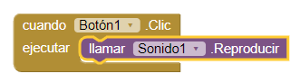

### Prueba

1. Seleccionamos la opción `Conectar > AI Companion` de la barra de menú superior.

   

2. Abrimos MIT AI2 Companion en el dispositivo móvil e introducimos el código.

   

3. Probamos la aplicación:

   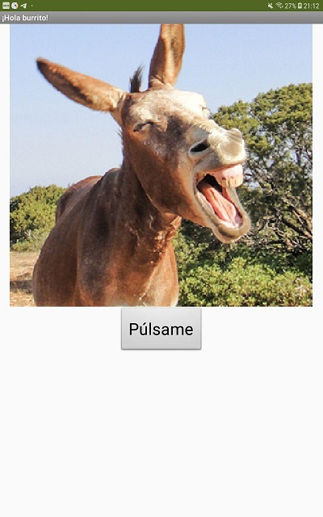

### Publicar el proyecto

[Instrucciones para publicar el proyecto](../../tutoriales/publicar-un-proyecto).