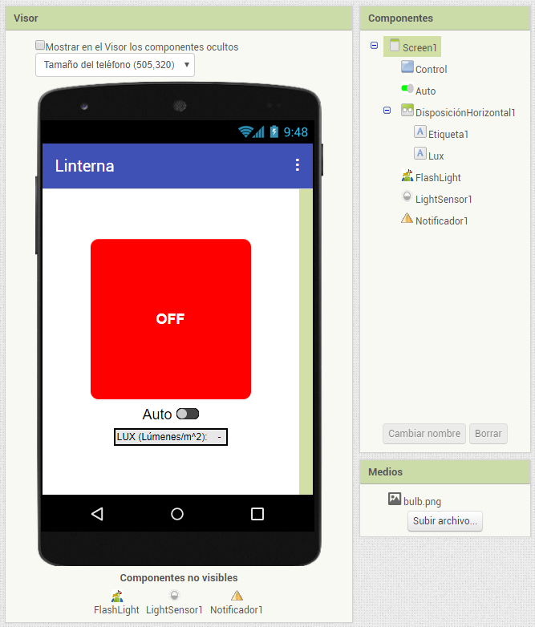
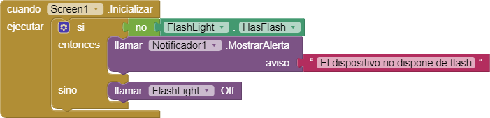
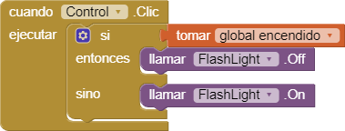
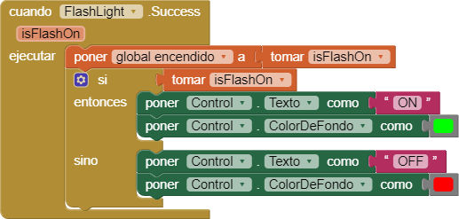
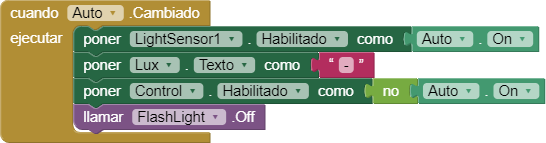
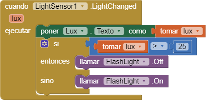
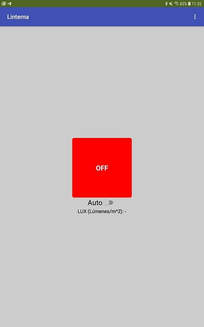

La app que vamos a desarrollar en este proyecto permite controlar el flash de la cámara del móvil para usarla como linterna. Igualmente, es posible ponerla en modo automático, de forma que cuando el sensor de luz detecte poca luz, la linterna se encienda automáticamente, y se apague en caso contrario.

La cantidad de luz se mide en **luxes** (lúmenes por metro cuadrado). El umbral de la aplicación son 25 luxes; es decir, por debajo de este nivel se encendería la linterna.

## Medios

* Icono de la aplicación: [bulb.png](bulb.png).

## Extensiones

[Importamos la extensión](../../tutoriales/importar-una-extension) **Flashlight** desde la siguiente dirección (URL):

```url
https://downloads.sourceforge.net/project/puravidaapps/com.puravidaapps.TaifunFlashlight.aix
```

## Interfaz

La interfaz de la pantalla principal será la siguiente:



## Comportamiento

### Al inicializar la pantalla



### Variable global para almacenar el estado de la linterna


### Pulsar el botón de encendido (ON/OFF)



### Cuando cambia el estado del flash



### Cuando cambiamos el interrruptor auto



### Cuando el sensor de luz detecta un cambio



## Prueba

