Aplicación de traducción de inglés a español.

## Crear el proyecto

Creamos un proyecto [nuevo](../../tutoriales/crear-un-nuevo-proyecto) de nombre `Traductor`.

## Medios {#medios}

Subimos la [imagen de fondo](https://raw.githubusercontent.com/fvarrui/AppInventor/master/proyectos/traductor/back.jpg) al panel de **Medios**.

## Interfaz

Abrimos el [**Diseñador**](../../tutoriales/disenador).

### Configuramos la pantalla principal

Establecemos la propiedad `ImagenDeFondo` de la pantalla `Screen1` a `back.jpg`, para mostrar una imagen de fondo en la pantalla principal de la app.

Cambiamos la propiedad `Título` de `Screen1` por `Traductor`.

### Añadimos los componentes

Arrastramos en el orden indicado los siguientes componentes desde la **Paleta** a la pantalla:

| Orden | Tipo         | Nombre (por defecto) |
| ----- | ------------ | -------------------- |
| 1     | Etiqueta     | Etiqueta1            |
| 2     | CampoDeTexto | CampoDeTexto1        |
| 3     | Etiqueta     | Etiqueta2            |
| 4     | Botón        | Botón1               |

La interfaz quedaría entonces así:

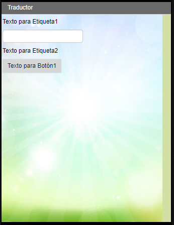

#### Renombramos los componentes

[Cambiamos los nombres](../../tutoriales/renombrar-un-componente) de los componentes por los que se indican a continuación:

| Nombre actual (por defecto) | Nuevo nombre    |
| --------------------------- | --------------- |
| Etiqueta1                   | TituloLabel     |
| CampoDeTexto1               | TraducirTextBox |
| Etiqueta2                   | TraduccionLabel |
| Botón1                      | TraducirButton  |

Quedando de la siguiente manera:

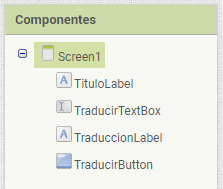

### Cambiamos la propiedad `Texto` de los componentes

Para los siguientes componentes, establecemos los siguientes valores en su propiedad `Texto`:

| Componente      | Texto                                |
| --------------- | ------------------------------------ |
| TituloLabel     | Introduce debajo el texto a traducir |
| TraduccionLabel | texto traducido                      |
| TraducirButton  | Traducir                             |

### Añadir el componente `TraductorYandex`

Desde la sección **Medios** de la **Paleta**, arrastramos el componente `TraductorYandex` a la pantalla. Al tratarse de un **Componente no visible** se mostrará debajo de la pantalla.

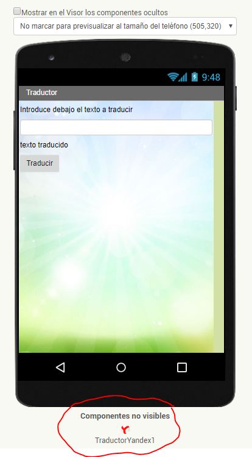

## Comportamiento

Abrimos el [Editor de bloques](../../tutoriales/editor-de-bloques).

### Añadir el evento Clic al botón

Seleccionamos el botón `TraducirButton` en el panel de **Bloques** y arrastramos el bloque de evento `cuando TraducirButton.Clic` al **Visor**.

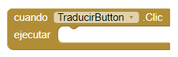

Los bloques dentro de éste se ejecutarán cuando se pulse el botón `TraducirButton`.

### Solicitar la traducción

Seleccionamos el componente `TraductorYandex1` y arrastramos el bloque `llamar TraductorYandex1.SolicitarTraduccion` dentro del bloque `cuando TraducirButton.Clic`.

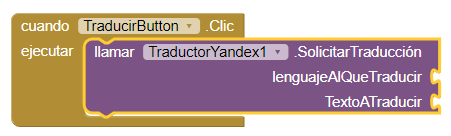

De este modo, al pulsar el botón `TraducirButton` se solicitará al componente `TraductorYandex1` que realice una traducción.

### Especificar qué lenguajes va a traducir

Como vamos a traducir de *Español* a *Inglés*, debemos indicar al componente `TraductorYandex1` esa información.

Desde la sección `Texto` del panel `Bloques` arrastramos un bloque de texto vacío `""` y lo encajamos en el conector `lenguajeAlQueTraducir` del bloque que añadimos en el paso anterior.

 Pulsamos en el bloque de texto vacío `""`  e introducimos `en-es` (para traducir del inglés al español).

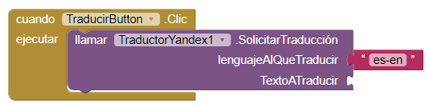

> En la siguiente ilustración se explica lo que significa el texto introducido. Si quisiéramos traducir del inglés al español, debemos indicar `en-es`.
>
> 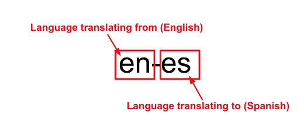

### Especificar el texto que se va a traducir

Debemos indicar el texto que vamos a traducir de Español a Inglés, y en este caso es el texto introducido en el cuadro de texto `TraducirTextBox`.

Seleccionamos el componente `TraducirTextBox` del panel de Bloques, arrastramos el bloque `TraducirTextBox.Texto` y lo encajamos en `TextoATraducir` del bloque `llamar TraductorYandex1.SolicitarTraduccion`.

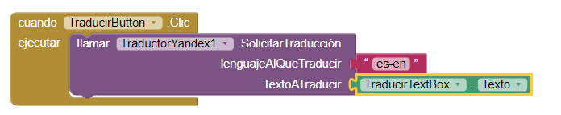

### Obtener el texto traducido

Cuando el componente `TraductorYandex1` tenga el texto traducidio, dispara el evento `TraduccionRecibida`.

Seleccionamos el componente `TraductorYandex1` del panel **Bloques** y arrastramos el bloque `cuando TraductorYandex1.TraduccionRecibida`. Los bloques que metamos dentro de éste se ejecutarán justo cuando `TraductorYandex1` disponga del texto traducido, ya que la traducción no se realiza en nuestro PC, sino que se hace a través de un servicio remoto.

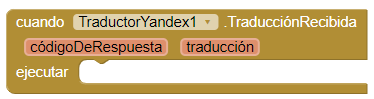

### Mostrar la traducción

Queremos mostrar el texto traducido en la etiqueta `TraduccionLabel`, para lo que seleccionamos dicho componente del panel de Bloques y arrastramos el bloque `poner TraduccionLabel.Texto como` dentro del bloque del evento anterior.

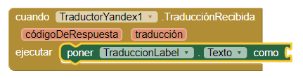

Vemos que en el bloque del evento `cuando TraductorYandex1.TraduccionRecibida` hay dos componentes: `códigoRespuesta` y `traducción`. El componente `traducción` contiene el texto traducido, así que hacemos movemos el puntero del ratón sobre él y cogemos el bloque `tomar traducción`. Este bloque lo vamos a encajar al final del bloque `poner TraduccionLabel.Texto como`.

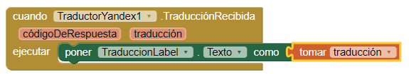

De este modo, cuando el componente `TraductorYandex` reciba la traducción del texto, se pondrá la `traducción` en la propiedad `Texto` de la etiqueta `TraduccionLabel`, forma que se mostrará al usuario lo que se ha traducido.

## Prueba

Ahora debemos [probar la aplicación en el dispositivo móvil](../../tutoriales/probar-la-aplicacion-en-el-dispositivo-movil-mediante-wi-fi).

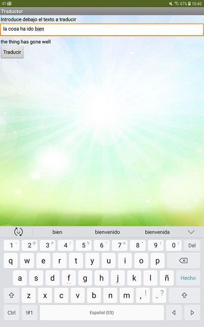