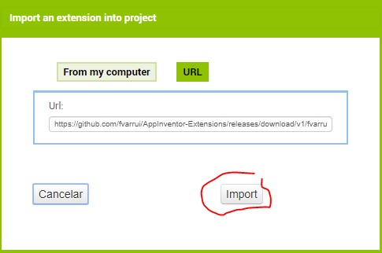
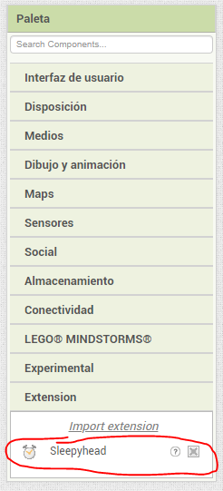
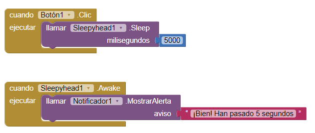
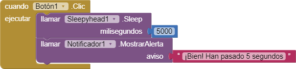

Para poder añadir un retardo o tiempo de espera durante la ejecución, debemos [importar](importar-una-extension) en nuestro proyecto la siguiente extensión:

```bash
https://github.com/fvarrui/AppInventor-Extensions/releases/download/v1/fvarrui.appinventor.components.aix
```



Esta extensión de App Inventor contiene el componente **Sleepyhead** (dormilón).



Se trata de un componente no visible, así que al arrastrarlo a la pantalla (Screen) lo veremos en la parte inferior. 

Este componente no tiene propiedades, sólo un método que debemos usar desde el **Editor de bloques** del siguiente modo:


>  El bloque anterior añade un retardo de 5000 ms (5 segundos).

## Ejemplo

En el siguiente ejemplo se añade un retardo de 5 segundos al pulsar el `Botón1`. Cuando transcurren los 5 segundos, se dispara el evento `Awake` que en este caso muestra una notificación al usuario.



> Los bloques que pongamos debajo de `llamar Sleepyhead1.Sleep` también se ejecutarán después de que transcurra el tiempo indicado, luego, el bloque `Awake` es opcional.

El siguiente ejemplo funciona igual que el anterior:

