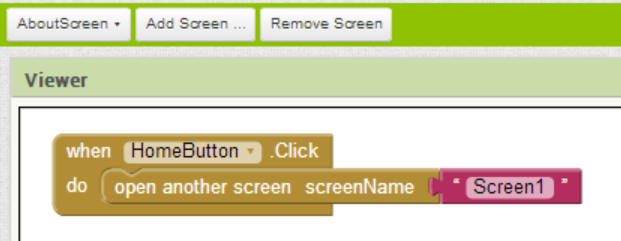

Para cambiar de pantalla debemos usar el bloque `open another screen`  pasándole una cadena de texto con el nombre de la pantalla a la que queremos ir. 

En el ejemplo anterior, se cambia a la pantalla `Screen1` al hacer clic en el botón `HomeButton`.

