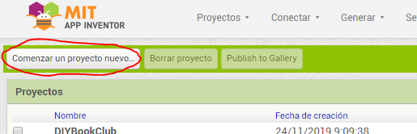
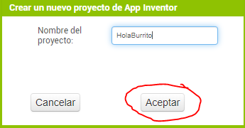
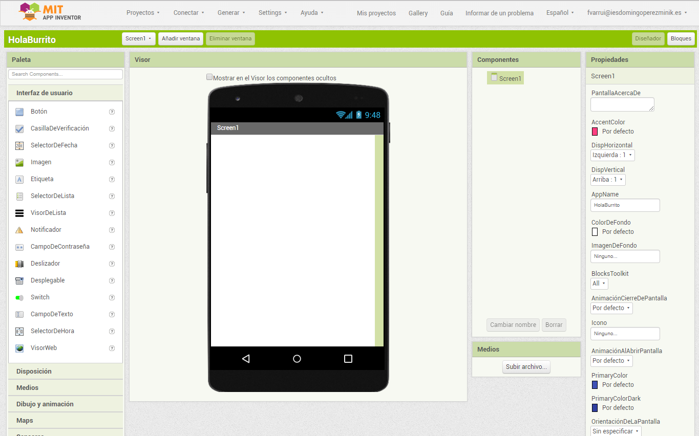

Para crear un proyecto debemos pulsar el botón **Comenzar un proyecto nuevo...**. desde la página principal de **App Inventor**.

Luego introducimos el nombre del nuevo proyecto en el diálogo que aparece y pulsar el botón **Aceptar**:

Y se creará y abrirá nuestro nuevo proyecto:

