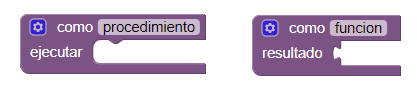
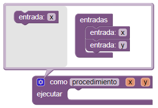
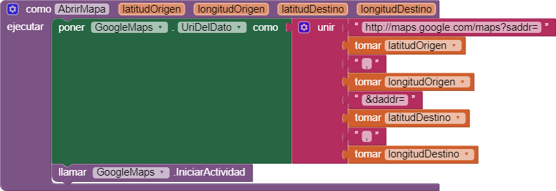
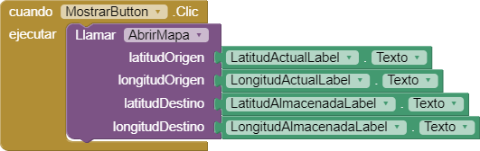
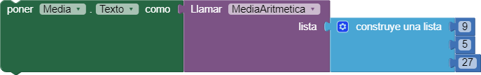

Los **procedimientos** permiten agrupar un conjunto de bloques que realizan una acción concreta para reutilizarlos. 

Para definir un procedimiento usamos los siguientes bloques:

Es necesario dar un nombre de los procedimientos para poder referenciarlos posteriormente.

Hay procedimientos que pueden devolver un resultado. A este tipo de procedimientos también se les llama **funciones**. En la figura anterior es el bloque de la derecha.

Los procedimientos pueden recibir parámetros o **entradas**, que es información necesaria para que el procedimiento pueda realizar su cometido. Para definir parámetros a un procedimiento debemos pulsar el botón azul y arrastar los bloques de entradas al procedimiento tal y como se observa en la siguiente imagen:

En la imagen anterior se han definido dos entradas (`x` e `y`) para el procedimiento.

## Ejemplo de procedimiento

A continuación se **define** un procedimiento al que se le pasan la **latitud** y la **longitud** del origen y del destino de una ruta que queremos que se habra en la aplicación Google Maps:

> En el ejemplo anterior *GoogleMaps* es un componente de tipo `ActivityStarter`, que permite abrir otras aplicaciones disponibles en el dispositivo móvil.

Al definir un procedimiento dispondremos de un nuevo bloque que podremos **llamar** del siguiente modo:

## Ejemplo de procedimiento que devuelve un valor

El siguiente procedimiento, de nombre **MediaAritmetica**, devuelve la media aritmética de la **lista** de números que recibe como entrada:

Se define la variable local **media** que inicialmente vale 0. Luego se recorre la lista de números y se van sumando a **media**. Después se divide el resultado de sumar todos los elementos de la lista por el número total de elementos. Y finalmente, se devuelve el valor de **media** como resultado.

Seguidamente, podremos llamar al procedimiento **MediaArtimetica** definido antes:

