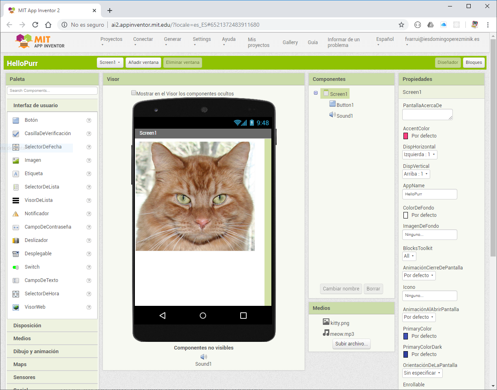

Desde aquí diseñamos las interfaces gráficas de usuario de nuestras aplicaciones.

El **Diseñador** está compuesto por los siguientes paneles:

* **Paleta**: desde aquí podremos arrastrar los componentes que queramos al **Visor** para construir nuestra interfaz.
* **Visor**: En este panel veremos el aspecto que tendrá nuestra interfaz. Hasta aquí arrastramos los componentes de la paleta. Podemos seleccionar un componente haciendo clic sobre él en este panel.
* **Componentes**: Aquí se muestra un árbol con los componentes que conforman la interfaz que estamos diseñando. Podemos seleccionar un componente haciendo clic sobre su nombre en este panel.
* **Medios**: Aquí gestionamos los recursos (assets) necesarios para nuestra aplicación (archivos de texto, de audio, vídeos, ...). 
* **Propiedades**: En este panel podemos modificar las propiedades de los componentes. Se mostrarán las propiedades del componente seleccionado en cada momento.