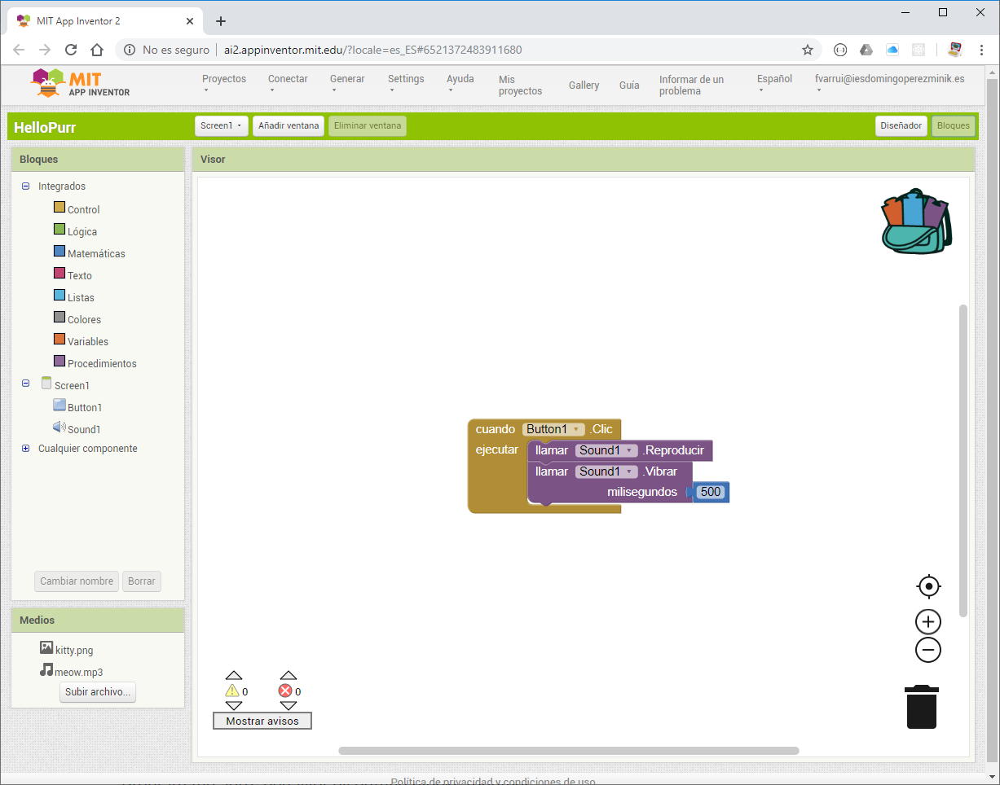

Aquí programamos el comportamiento de nuestra aplicación combinando bloques.

El **Editor de bloques** está compuesto por los siguientes paneles:

* **Bloques**: Contiene todos los bloques que podemos utilizar para definir el comportamiento de nuestra aplicación. Debemos arrastrarlos y combinarlos en el **Visor**.
* **Visor**: Este panel contiene los bloques que determinan el comportamiento de nuestra aplicación. Hasta aquí arrastramos los bloques desde el panel **Bloques**.
  * **Mochila** (esquina superior derecha): Si queremos reutilizar bloques los podemos arrastrar a la mochila (equivalente a copiar y pegar).
  * **Papelera** (esquina inferior derecha): Los bloques que queremos eliminar los arrastramos a la papelera.
  * **Avisos** (esquina inferior izquierda): Nos muestra errores que hayamos podido cometer al combinar los bloques. Si no resolvemos estos errores, nuestra aplicación no funcionará. También muestra advertencias de cosas que pueden dar problemas a la hora de ejecutar nuestra app.
* **Medios**: Aquí gestionamos los recursos (assets) necesarios para nuestra aplicación (archivos de texto, de audio, vídeos, ...). Se muestra lo mismo que en el [Diseñador](el-disenador).