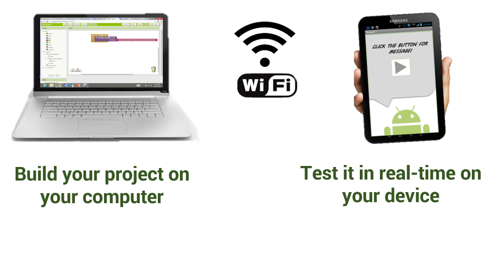
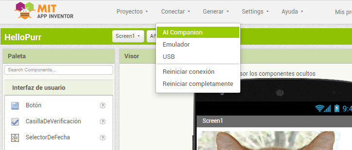
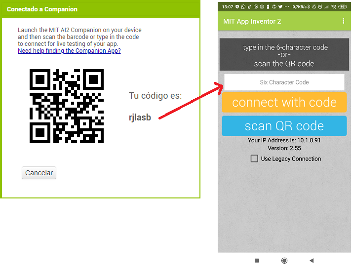

Es posible probar nuestras aplicaciones directamente en nuestro móvil o tablet sin necesidad de instalar nada en nuestro PC. 

Sólo tendremos que desarrollar nuestra app desde la aplicación web de [App Inventor](http://ai2.appinventor.mit.edu/), instalar en el dispositivo móvil Android la aplicación **MIT AI2 Companion** desde **Google Play** y ya podremos probar en vivo nuestra aplicación en el móvil o tablet, tal y como se muestra en la siguiente ilustración.

### 1. Instalar MIT AI2 Companion en el dispositivo

Descargamos e instalamos **MIT AI2 Companion** desde **Google Play**.

También es posible acceder directamente a la instalación de **MIT AI2 Companion** escaneando el siguiente código QR desde el dispositivo móvil o pulsar este [enlace](https://play.google.com/store/apps/details?id=edu.mit.appinventor.aicompanion3):

### 2. Conectar el PC y el dispositivo móvil a la misma red Wi-Fi

### 3. Conectar un proyecto desde App Inventor con el dispositivo móvil

En la aplicación web de **App Inventor** abrimos un proyecto, y a continuación abrimos `Conectar > AI Companion`.

Se abrirá una ventana con un código QR y un código formado por 6 letras en el PC. 

A continuación, en el dispositivo abrimos la app **MIT App Companion**, y desde aquí podemos hacerlo de dos formar: 

- Introducir el código de 6 letras y pulsar el botón `connect with code`.
- Pulsar el botón `scan QR code` y escanear el código QR de la pantalla del PC con la cámara del dispositivo móvil.

En unos pocos segundos aparecerá la aplicación que estamos desarrollando en el dispositivo movil y podremos probarla. Si realizamos cambios en el proyecto, estos aparecerán reflejados automáticamente en el dispositivo móvil.

### Resolución de problemas

Si nuestra app no aparece en el dispositoivo, posiblemente se deba a alguno de las siguientes causas:

- No tenemos una versión actualizada de la app MIT AI2 Companion. Deberemos actualizar la app a la última versión.
- El dispositivo no se pudo conectar al Wi-Fi. Debemos asegurarnos de que aparece una dirección IP en la parte inferior de la app.
- El dispositivo no se pudo conectar a la misma red Wi-Fi que el PC. Debemos asegurarnos que ambos dispositivos están en la misma red Wi-Fi.
- Nuestro centro u organización no dispone de una red Wi-Fi. En este caso podemos usar AppInventor mediante un emulador o conectar el dispositivo al PC mediante un [cable USB](probar-la-aplicacion-en-el-dispositivo-movil-mediante-cable-usb).
