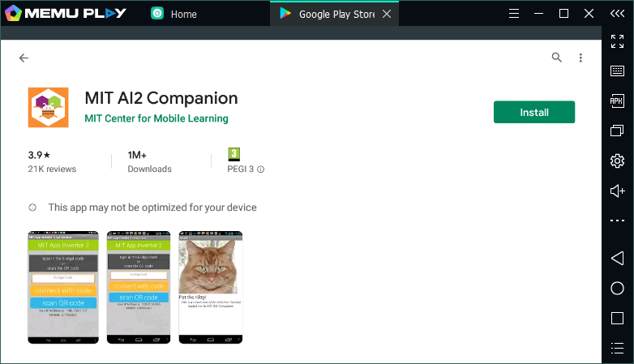
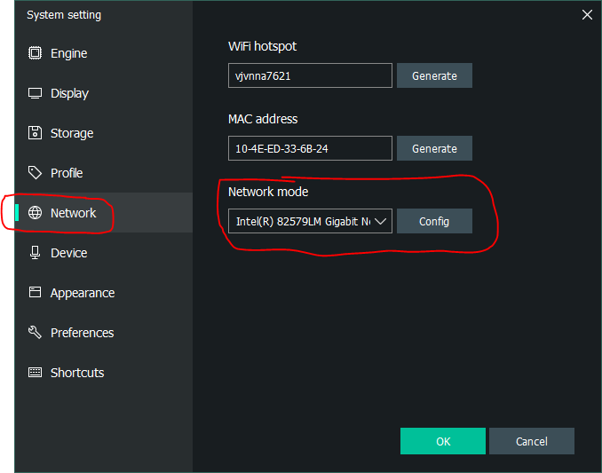
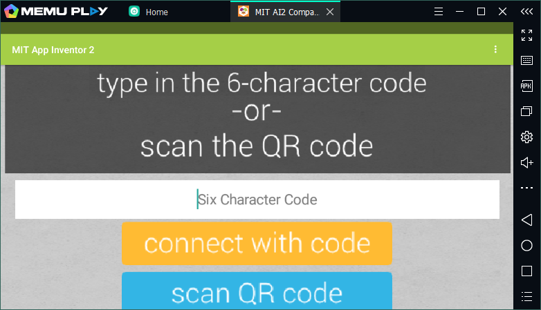
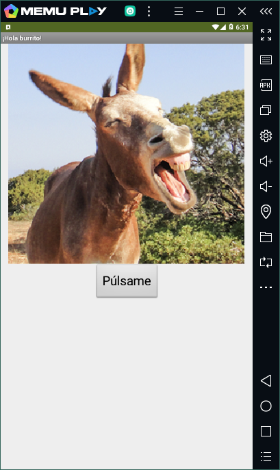

Es posible ejecutar nuestra aplicación App Inventor en un emulador cuando no disponemos de un dispositivo móvil Android donde probarla.

En este artículo, en vez de utilizar el *primitivo* emulador que ofrece App Inventor en las **AI2 Tools**, vamos a usar un emulador más completo, **MEMU**, que además permite simular algunos de los sensores del dispositivo: GPS,  acelerómetro, ...

1. **Descargar** [sitio web oficial]( http://www.memuplay.com/ ) e **instalar** MEMU.

2. Iniciar **MEMU**.

3. Abrir **Play Store** y vincular el dispositivo a nuestra cuenta de Google.

4. Instalar **MIT AI2 Companion** desde Google Play Store.

   

5. Debemos cambiar la configuración para que se pueda comunicar el navegador con MIT AI2 Companion.

   Para esto pulsamos el botón **Settings** (Ajustes) en el panel derecho de **MEMU** (), seleccionamos **Network** y la opción **Network mode** la establecemos a **Bridge network**. Una vez se instale el *driver* necesario, debemos seleccionar una interfaz de red de la lista, pulsar **Ok** y reiniciar el emulador ahora (**Restart now**).

   

6. Tras reiniciar el emulador, abrimos **MIT AI2 Companion** e introducimos el código para conectar con App Inventor, tal y como lo haríamos si tuviéramos un dispositivo móvil Android conectado por Wi-Fi.

   

   Por defecto el emulador funciona como una tablet, pero podemos cambiarlo para que se comporte como un teléfono en **Settings** () > **Display** > **Resolution**, tal y como vemos a continuación:

   