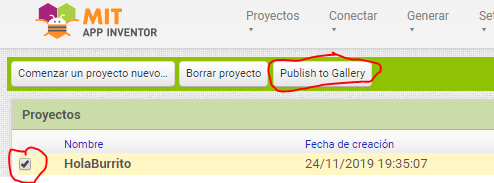
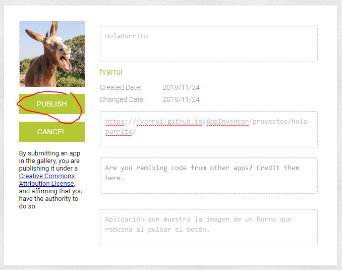
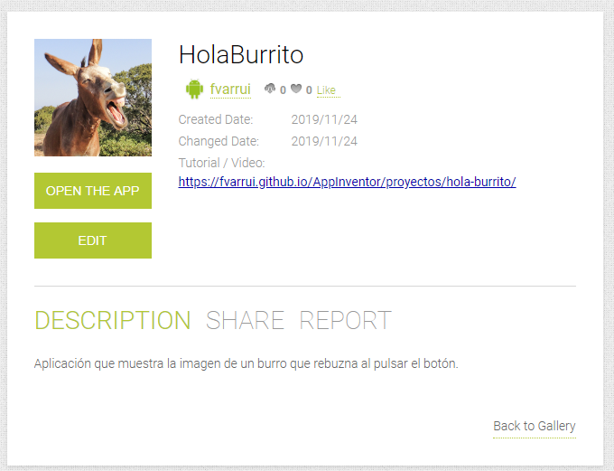
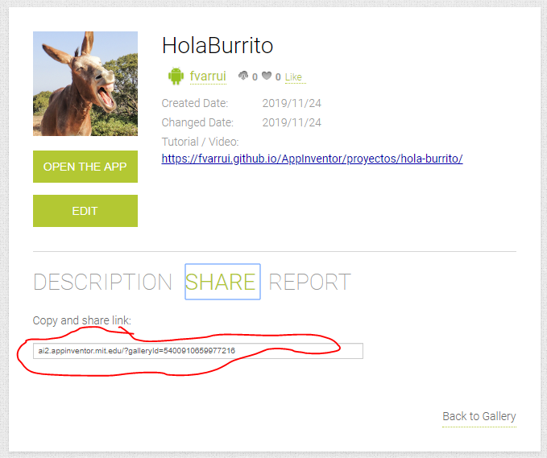

Para compartir un proyecto y que esté accesible para otras personas debemos publicarlo en App Inventor.

1. Seleccionamos el proyecto que queremos publicar en la página **Mis proyectos** y pulsamos el botón **Publish to Gallery**.

   

2. Cumplimentamos la información sobre nuestro proyecto y pulsamos el botón **Publish**.

   

3. Y con esto ya estaría publicado nuestro proyectos. Ahora cualquier usuario de AppInventor podrá abrirlo pulsando en **Open the app** y se creará una copia en su espacio de proyectos.

   

4. Podemos obtener un enlace directo al proyecto que podemos compartir seleccionando la opción **Share**, tal y como se muestra a continuación:

   

   