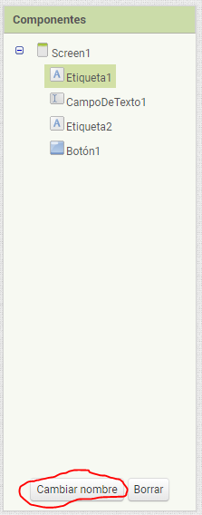
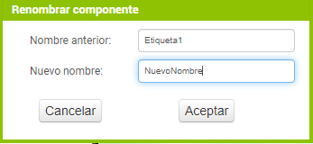

Los nombres de los componentes se utilizan para hacerles referencia desde los bloques.

Podemos cambiar los nombres de los componentes desde el **[Diseñador](disenador)** del siguiente modo:

1. Seleccionamos el componente que queremos renombrar desde el panel **Componentes** pulsamos el botón **Cambiar nombre** en la parte inferior del panel.

   

2. Introducimos el nuevo nombre del componente pulsamos el botón **Aceptar**.

   
