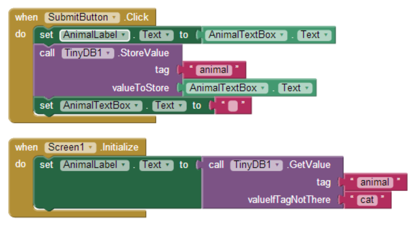

# Cómo intercambiar información entre pantallas (screens)

Los componentes y las variables disponibles en una pantalla no están disponibles en otra. Para poder intercambiar información entre pantallas es necesario usar el componente **TinyDB**. De este modo, necesitaremos un componente TinyDB definido en cada pantalla, y ambos deberán estar referenciando la misma base de datos.

Una o ambas pantallas podrán cambiar los datos compartidos, y en las pantallas en las que deseen recuperar los datos será necesario un bloque de tipo `Screen.Initialize`, como se muestra a continuación:

## Guardar el valor en la base de datos

En el ejemplo anterior, desde el evento `Click` de `SubmitButton` llamamos al método `StoreValue` del componente `TinyDB1` para almacenar una variable, pasándole en `tag` un nombre para el valor (que nos permitirá recuperar dicho valor con posterioridad a partir de este mismo nombre) y en `valueToStore` el valor que queremos guardar en la base de datos.

## Recuperar el valor de la base de datos

Luego, desde el evento `Initialize` de la pantalla podremos recuperar el valor almacenado llamando al método `GetValue` de `TinyDB`, donde `tag` es de nuevo el nombre del valor almacenado en la base de datos y que queremos recuperar, y `valueIfTagNotThere` es un valor por defecto que se utilizará en caso de que el valor indicado no exista en la base de datos.