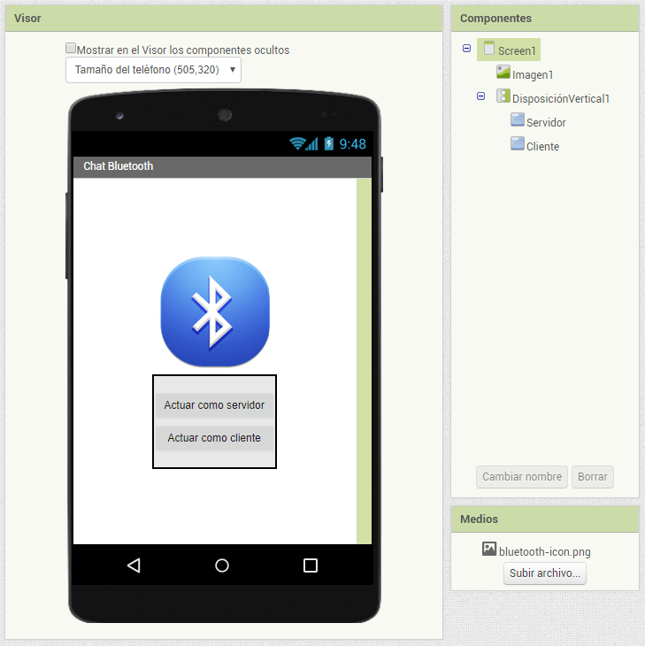
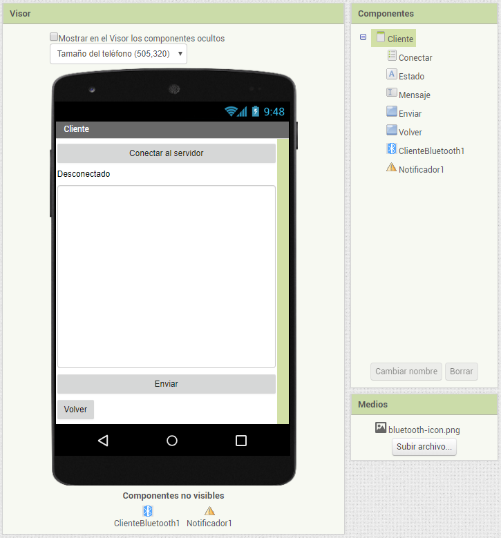
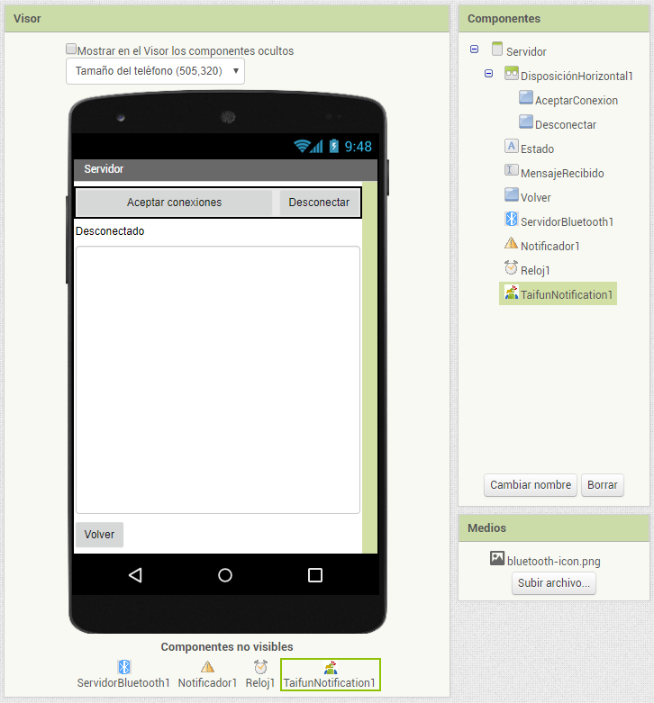

# Bluetooth

La siguiente aplicación permite la comunicación por Bluetooth de dos dispositivos. Un dispositivo desempeñará el rol de Servidor, que recibirá mensajes desde otro dispositivo, que hará de Cliente.

Desde la pantalla principal de la aplicación se podrá elegir si actuar como servidor o como cliente.

> :warning: Los dispositivos deben ser vinculados previamente desde los `Ajustes` del dispositivo.

## Diseñar la interfaz

La app contará con dos pantallas: 

- **Screen1**: Pantalla principal donde se podrá seleccionar entre Servidor o Cliente.
- **Cliente**: Pantalla desde la que se podrá conectar a un servidor y enviarle mensajes.
- **Servidor**: Pantalla desde la que se visualizarán los mensajes recibidos desde otro dispositivo.

### Screen1

### Cliente

## Servidor

## Comportamiento de la aplicación

### Screen1

#### Cambiar a la pantalla Cliente

Al pulsar el botón `Cliente` se abrirá la pantalla `Cliente`:

#### Cambiar a la pantalla Servidor

Al pulsar el botón `Servidor` se abrirá la pantalla `Servidor`:

### Cliente

#### Inicializar la pantalla `Cliente`

#### Seleccionar el servidor al que conectarse

#### Después de seleccionar el servidor

#### Enviar un mensaje

#### Cerrar la pantalla actual y volver a  `Screen1`

### Servidor

#### Inicializar la pantalla `Servidor`

#### Aceptar conexiones

#### Cuando se ha aceptado una conexión

#### Comproabr si se han recibido datos

#### Cerrar la conexión

#### Cerrar la pantalla y volver a `Screen1`

## Probar la aplicación

