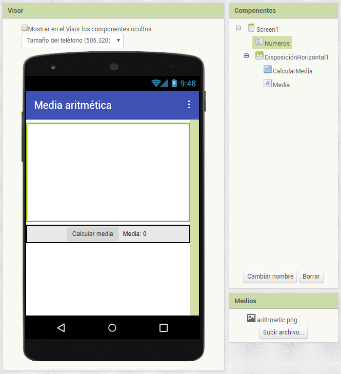
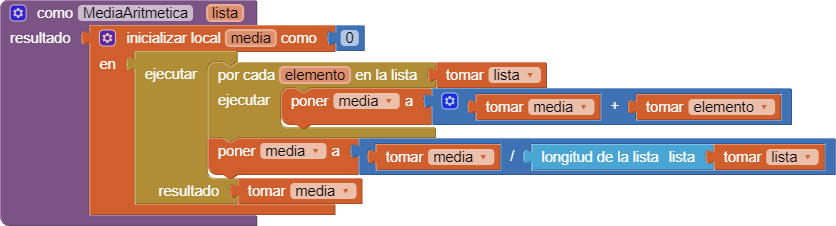
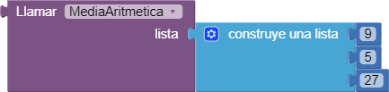
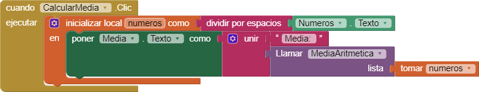
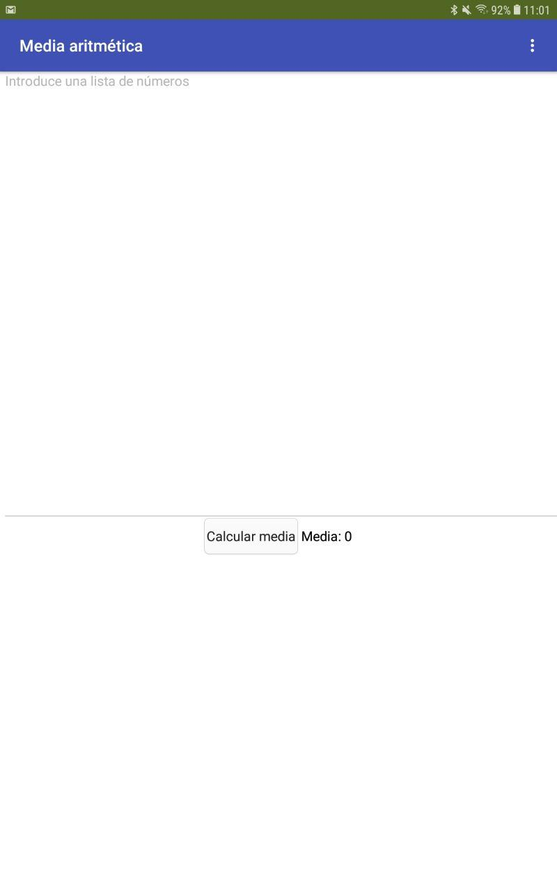

# Media aritmética

La app que vamos a desarrollar en este proyecto calcula la media aritmética de un conjunto de números.

La información se introduce mediante un cuadro de texto, que luego convertido en una lista de números para poder operar.

## Medios

* Descargar el [icono de la aplicación](arithmetic.png).

## Diseñar la interfaz

### Screen1

La interfaz de la pantalla principal será la siguiente:

## Comportamiento de la aplicación

### Screen1

#### Procedimiento `MediaAritmética`

Definición del procedimiento (función) `MediaAritmetica` que recibe una `lista` de números como entrada y devuelve la media.

Ejemplo de uso de la función `MediaAritmética`:

El bloque anterior devolverá `13,6`.

#### Calcular la media

## Probar la aplicación

