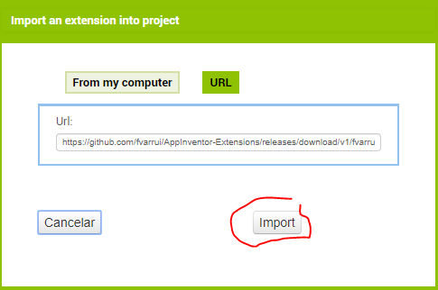

# Añadir un retardo (sleep)

Para poder añadir un retardo o tiempo de espera durante la ejecución, debemos [importar](importar-una-extension) en nuestro proyecto la siguiente [extensión](https://github.com/fvarrui/AppInventor/raw/master/extensiones/fvarrui.appinventor.components.aix):

```
https://github.com/fvarrui/AppInventor/raw/master/extensiones/fvarrui.appinventor.components.aix
```



Esta extensión de App Inventor contiene el componente **Sleepyhead** (dormilón).


Se trata de un componente no visible, así que al arrastrarlo a la pantalla (Screen) lo veremos en la parte inferior. 

Este componente no tiene propiedades, sólo un método que debemos usar desde el **Editor de bloques** del siguiente modo:


>  El bloque anterior añade un retardo de 5000 ms (5 segundos).