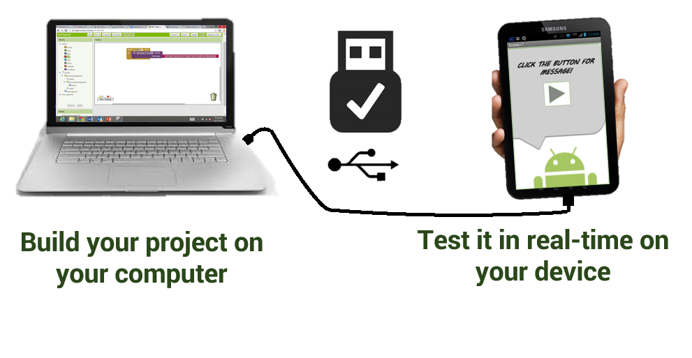
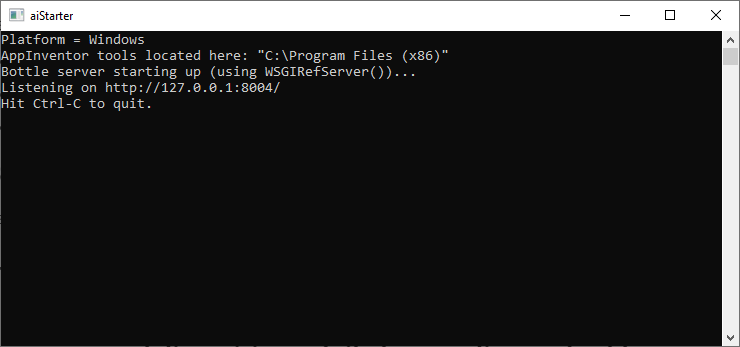
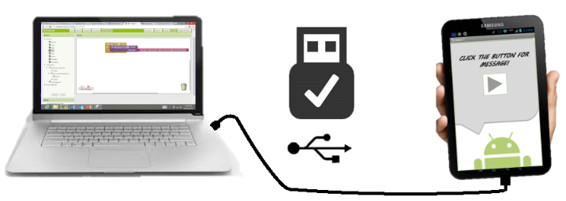
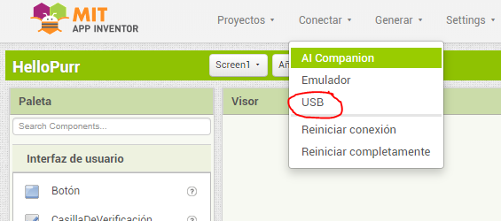
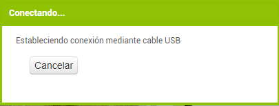

# Probar la aplicación en el dispositivo móvil mediante cable USB

Aunque la opción recomendada para probar nuestra aplicación es mediante conexión [Wi-Fi](probar-la-aplicacion-en-el-dispositivo-movil-mediante-wi-fi), también es posible probarla directamente en nuestro móvil o tablet conectando éste al PC mediante un cable USB.

A continuación se describen los pasos que hay que seguir para conectar el PC y el dispositivo de pruebas mediante cable USB:

### 1. Instalar MIT AI2 Companion en el dispositivo

Descargamos e instalamos **MIT AI2 Companion** desde **Google Play**.

También es posible acceder directamente a la instalación de **MIT AI2 Companion** escaneando el siguiente código QR desde el dispositivo móvil o pulsar este [enlace](https://play.google.com/store/apps/details?id=edu.mit.appinventor.aicompanion3):

### 2. Descargar e instalar MIT AppInventor Tools en el PC

Este proceso dependerá del sistema operativo de nuestro PC. Elije el enlace correspondiente:

- [Instrucciones para Mac OS X](https://appinventor.mit.edu/explore/ai2/mac)
- [Instrucciones para Windows](https://appinventor.mit.edu/explore/ai2/windows)
- [Instrucciones parar GNU/Linux](https://appinventor.mit.edu/explore/ai2/linux)

### 3. Ejecutar aiStarter en el PC

Este programa permite comunicar el navegador con el dispositivo conectado al cable USB.

### 4. Habilitar la depuración por USB en el dispositivo móvil

Dependiendo de la versión de Android, encontraremos la opción `USB Debugging` que debemos habilitar del siguiente modo:

- **Android 3.2 o anterior**: Ajustes > Aplicaciones > Desarrollador.
- **Android 4.0 o superior**: Ajustes > Desarrollador.

> Es posible que en las versiones más recientes de Android el panel de configuración **Desarrollador** aparezca oculto. Entonces debemos acceder al panel **Acerca del dispositivo**  en **Ajustes** y pulsar 7 veces sobre la opción **Número de compilación** (Build number).

### 5. Conectar el dispositivo móvil al PC mediante el cable USB

### 6. Conectar un proyecto desde App Inventor con el dispositivo móvil

En la aplicación web de **App Inventor** abrimos un proyecto, y a continuación abrimos `Conectar > USB`.

Se abrirá un diálogo indicando que se está estableciendo la conexión con el dispositivo:

En unos pocos segundos aparecerá la aplicación que estamos desarrollando en el dispositivo movil y podremos probarla. Si realizamos cambios en el proyecto, estos aparecerán reflejados automáticamente en el dispositivo móvil.
